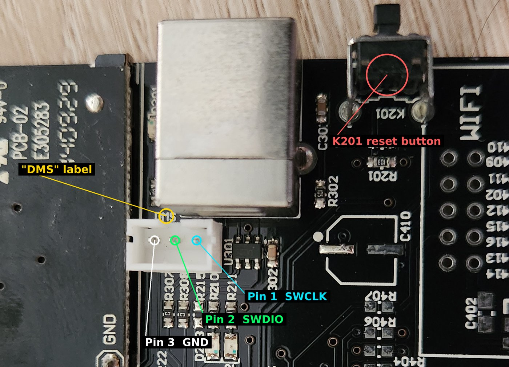
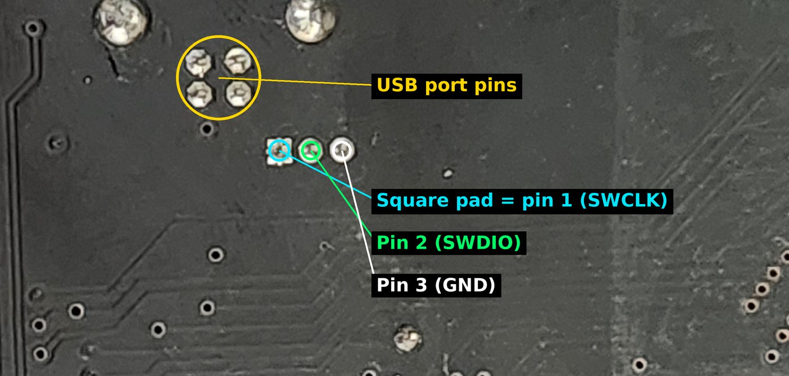
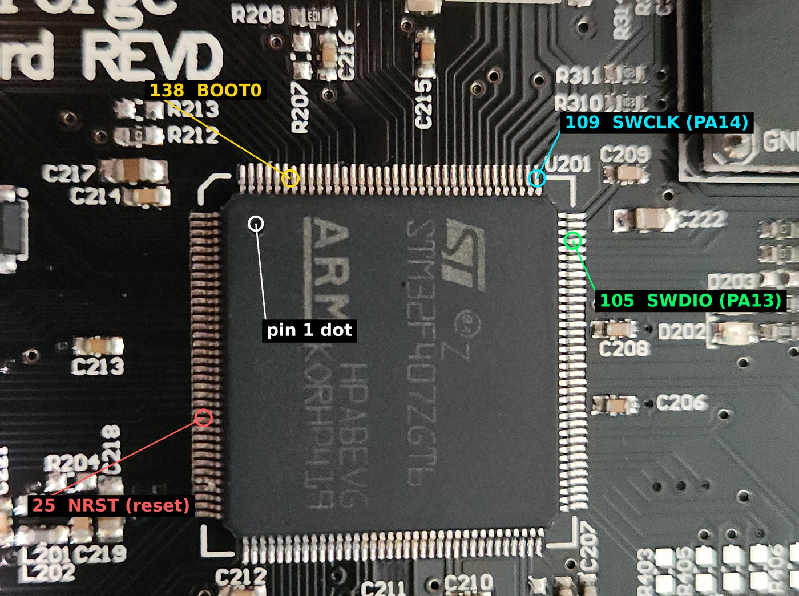

# ST-Link recovery

An ST-Link is a small USB programmer that writes straight into the printer's main chip. It doesn't depend on the bootloader or the firmware, so it works when nothing else does. Use it to fix a printer that won't boot after a bad flash.

The method comes from the firmware maintainer's answer in [discussion #101](https://github.com/moonglow/FlashForge_Marlin/discussions/101) and the pinout on the [backup firmware wiki page](https://github.com/moonglow/FlashForge_Marlin/wiki/Backup-printer-firmware). The photos and tool notes come from a real recovery of a 3D20 with a FlashForge Coreboard Rev D. See [A real recovery](#a-real-recovery) at the end.

**Time needed:** about an hour the first time, once the parts arrive.

## Buy an ST-Link

Any of these work. For a one-time recovery, the clone stick is the easiest choice.

| Option | Rough cost | Notes | Where to buy |
|---|---|---|---|
| **Clone ST-Link V2 USB stick** | $8 to $15 | Easiest. Pins are labeled on the case, and most come with female to female jumper wires. Use it with **ST-Link Utility** (see step 1) | [Amazon search](https://www.amazon.com/s?k=st-link+v2+programmer), [AliExpress search](https://www.aliexpress.com/w/wholesale-st-link-v2.html) |
| **Official STLINK-V3MINIE** | $12 to $15 | Genuine ST part. It uses a small 1.27 mm 14-pin cable, so you also need a breakout adapter or fine jumper wires | [ST product page](https://www.st.com/en/development-tools/stlink-v3minie.html), [Digi-Key](https://www.digikey.com/en/products/detail/stmicroelectronics/STLINK-V3MINIE/16284301), [Mouser](https://www.mouser.com/c/?q=STLINK-V3MINIE) |
| **An STM32 Nucleo board you already own** | Free if you have one | Every Nucleo-64 board has an ST-Link built in. Remove both CN2 jumpers, then use the CN4 header: pin 2 SWCLK, pin 3 GND, pin 4 SWDIO | You already have it |

You also need:

- Three or four female to female jumper wires.
- A multimeter with a continuity (beep) setting.
- Optional but helpful: small clip leads, or a soldering iron to tack wires on.

## 1. Install the software

Pick the program that matches your ST-Link.

| Your ST-Link | Use | Notes |
|---|---|---|
| Clone ST-Link V2 | **[STM32 ST-Link Utility](https://www.st.com/en/development-tools/stsw-link004.html)** | Older ST tool that ST no longer updates. In our recovery, STM32CubeProgrammer would not talk to a clone V2, and ST-Link Utility worked |
| Genuine ST-Link (V2 or V3) | **[STM32CubeProgrammer](https://www.st.com/en/development-tools/stm32cubeprog.html)** | ST's current tool |
| Either, if the above fail | **[OpenOCD](#using-openocd-instead)** | Command line. Often works with clones that other tools refuse |

Both ST programs are free but need an ST account to download. Their installers include the ST-Link USB driver.

Also install Python 3 from [python.org](https://www.python.org/downloads/) if you don't have it. You need it for the next step.

## 2. Make the unencrypted firmware

The `.bin` files in the Marlin release are encrypted for the bootloader. The ST-Link writes straight to the chip, with no bootloader in between, so it needs the **unencrypted** version.

1. Download [`ff_firmware_tool.py`](../reference/downloads.md#firmware-tool) from this guide.
2. Put it in the same folder as your Marlin file, for example `dremel_2.0.9.5_01152023.bin`.
3. Open a terminal in that folder (in Windows File Explorer, type `cmd` in the address bar and press Enter) and run:

    ```
    python ff_firmware_tool.py decrypt dremel_2.0.9.5_01152023.bin dremel_unencrypted.bin
    ```

4. Look for **Check passed** in the output. If you see a WARNING, the file is not a 3D20 build. Don't flash it.

??? info "Advanced: using the original C tool"
    The script is a port of [moonglow/flashforge_firmware_tool](https://github.com/moonglow/flashforge_firmware_tool) and produces the same output byte for byte. To use the original, build it with `gcc main.c -o ff_fw_tool` and run:

    ```
    ./ff_fw_tool -k flashforge123456 -i dremel_2.0.9.5_01152023.bin -o dremel_unencrypted.bin
    ```

    Leaving out `-e` means decrypt. `flashforge123456` is the Dremel key.

## 3. Find the SWD socket

1. Turn the printer off and unplug it.
2. Flip it over and remove the six 2.5 mm hex screws from the bottom cover. The cover is held by a grounding strap, so lift it gently.
3. Find the small **white 3-pin connector next to the USB port**. On the Coreboard Rev D it is labeled **DMS**, which makes it look like a sensor plug. It doubles as the SWD socket.



| Socket pin | Signal | Goes to chip leg |
|---|---|---|
| 1 | SWCLK | 109 (PA14) |
| 2 | SWDIO | 105 (PA13) |
| 3 | GND | Ground |

The pin numbers come from the solder joints on the back of the board. Pin 1 has the **square** pad.



!!! tip "Removing the board makes this easier"
    Working inside the printer is cramped. You can unplug the cables, lift the board out, and work on a bench. To power it for programming, reconnect only the power supply cable. Take photos of every cable before you unplug anything.

## 4. Check the wiring with a multimeter

This step catches most connection failures before you open any software. Do it with the **board unpowered**.

The chip's legs are numbered counterclockwise from the corner with the small dot (pin 1). On this board:



1. Set the meter to continuity.
2. Put one probe on the **ST-Link end** of each jumper wire, and touch the other gently to the chip leg it should reach. Use a sharp probe tip, on the leg where it meets the board.

    | Wire | Should beep to |
    |---|---|
    | SWCLK | Chip leg 109 |
    | SWDIO | Chip leg 105 |
    | GND | The metal shell of the USB port |

3. If a wire doesn't beep, its contact is the problem, not the software. The connector's plastic housing often keeps jumper ends from reaching the pins. Push them fully in, or clip or tack-solder the wires to the solder joints on the back of the board.

??? info "What the voltages look like with power on"
    With the board powered and the ST-Link unplugged, measure each socket pin against the USB shell in DC volts. On our board with bad firmware running, pin 1 read 0.01 V, pin 2 read 1.2 V, and pin 3 read 0 V. The connection still worked once the wiring was right, so a low reading on pin 2 alone doesn't mean the port is dead. If you see 5 V or 24 V on any pin, you are on the wrong connector. Stop.

## 5. Connect

| ST-Link pin | Printer SWD socket |
|---|---|
| SWCLK | Pin 1 (SWCLK) |
| SWDIO | Pin 2 (SWDIO) |
| GND | Pin 3 (GND) |
| 3.3V | **Not connected.** The printer powers itself |
| RST | Optional. See [If it won't connect](#if-it-wont-connect) |

1. Connect the wires.
2. Plug in the printer's power and turn it on.
3. Plug the ST-Link into your PC.

=== "ST-Link Utility"

    1. Open STM32 ST-Link Utility.
    2. Go to **Target > Settings**. Choose **SWD**, a low frequency such as **480 kHz** if the list offers it, and **Mode: Normal**.
    3. Go to **Target > Connect**. The log at the bottom should name the device as an STM32F40x/F41x.

=== "CubeProgrammer"

    1. Open STM32CubeProgrammer.
    2. In the top right, choose **ST-LINK** and click the refresh button next to the serial number.
    3. Set **Port** to SWD, **Frequency** to 480 kHz, **Mode** to Normal, **Reset mode** to Software reset.
    4. Click **Connect**. The log should name the chip as an STM32F40x/F41x.

## 6. Back up the chip

Always make a backup before you write anything. It also tells you whether the bootloader survived.

The **bootloader** is the part you can't replace easily. It lives in the first 64 KB. Back that up first, as its own file.

=== "ST-Link Utility"

    1. In the boxes at the top of the main window, set **Address** `0x08000000`, **Size** `0x10000`, **Data Width** 32 bits. Press **Enter**.
    2. Go to **File > Save file as**, choose **.bin**, and save it as `3d20-08000000-bootloader.bin`.

    !!! warning "ST-Link Utility can crash on large reads"
        In our recovery, reading the whole 1 MB chip at once crashed the program. Reading 64 KB worked. Read in pieces instead, as shown below.

=== "CubeProgrammer"

    1. In the memory view, set **Address** `0x08000000` and **Size** `0x10000`. Click **Read**.
    2. Use the arrow next to **Read** and choose **Save As**. Save it as `3d20-08000000-bootloader.bin`.

**Optional: back up the rest of the chip.** The rest holds the firmware, which is the broken part, so this backup is mainly for completeness. If a large read crashes or fails, use smaller pieces and name each file after its start address:

| Address | Size | File name |
|---|---|---|
| `0x08010000` | `0x10000` | `3d20-08010000.bin` |
| `0x08020000` | `0x20000` | `3d20-08020000.bin` |
| `0x08040000` | `0x40000` | `3d20-08040000.bin` |
| `0x08080000` | `0x80000` | `3d20-08080000.bin` |

If a piece still crashes, split it in half and try again.

### Check the bootloader

Look at the first row at `0x08000000`:

| First word | Second word | Meaning |
|---|---|---|
| `2000xxxx` or `2001xxxx` | `0800xxxx` | Bootloader intact. Go to step 7 |
| `FFFFFFFF` | `FFFFFFFF` | Bootloader gone. Go to [Restore the bootloader](#restore-the-bootloader) first |
| Anything else | | Stop and [ask for help](../contributing.md#reporting-a-problem) before writing |

!!! danger "Read protection"
    If the software reports **read out protection level 1**, stop. Removing that protection erases the entire chip, bootloader included. Ask in [discussion #101](https://github.com/moonglow/FlashForge_Marlin/discussions/101) before you go on.

## 7. Write the firmware

The firmware always goes to **`0x08010000`**. The tools default to `0x08000000`, which would overwrite the bootloader. Check the address twice.

=== "ST-Link Utility"

    1. Go to **Target > Program & Verify** (Ctrl+P).
    2. Select `dremel_unencrypted.bin`.
    3. Set **Start address** to `0x08010000`.
    4. Leave **Skip Flash Erase** unticked. It erases only the sectors the file needs.
    5. Tick **Verify after programming**.
    6. Click **Start** and wait for the verify to pass.

    Never use **Target > Erase Chip**. It wipes the bootloader.

=== "CubeProgrammer"

    1. Open the **Erasing & Programming** page (the second icon on the left toolbar).
    2. **File path:** `dremel_unencrypted.bin`.
    3. **Start address:** `0x08010000`.
    4. Tick **Verify programming**.
    5. Click **Start Programming** and wait for "File download complete" and a successful verify.

    Never click **Full chip erase**. It wipes the bootloader.

## 8. Restart

1. Disconnect in the software (**Target > Disconnect** or **Disconnect**).
2. Turn the printer off and remove the jumper wires.
3. Reconnect any cables you unplugged, using your photos.
4. Turn it on. You should see the Dremel start screen, then Marlin.
5. Follow [After any recovery](failed-flash.md#after-any-recovery).

You can leave `sys/dremel.bin` on the internal card if it's the same version. For future updates, use the normal [SD card method](../firmware/update.md).

## If it won't connect

Work down this list in order.

| What you see | What to do |
|---|---|
| ST-Link not detected, no serial number | Reinstall the driver. Try another USB port. Don't upgrade a clone's firmware. Some stop working afterward |
| CubeProgrammer never connects to a clone V2 | Switch to **ST-Link Utility** or OpenOCD |
| Log says "UR connection mode is defined with the SWrst reset mode" | This is only a notice. **Mode** is still set to Under reset. Change **Mode** itself to Normal. The real error is on the next log line |
| "No STM32 target found" or "Cannot connect to target" | Wiring. Redo [step 4](#4-check-the-wiring-with-a-multimeter) from the ST-Link end of each wire. Then lower the frequency to 480 kHz |
| Wiring checks out, still no connection | Hold the chip in reset while connecting. See below |
| Program crashes while reading | Read smaller pieces. See [step 6](#6-back-up-the-chip) |
| Verify fails | Lower the frequency and try again. Check the start address |

### Connect while holding reset

If the bad firmware switches off the debug pins as soon as it starts, connect while the chip is held in reset, before that code can run.

- **Quick try:** set **Mode** to Under reset (Connect under reset in ST-Link Utility). Press and hold the **K201** reset button, click Connect, and release the button about a second later. Try a few times with different timing.
- **More reliable:** wire the ST-Link's **RST** pin to the reset line. With the board powered, measure the two legs of the K201 button against ground. One reads about 3.3 V. That is the reset line. Connect RST there, and use **Mode: Under reset** with **Reset mode: Hardware reset**.

### Last resort: BOOT0

Holding the chip's **BOOT0** leg (138, marked on the chip photo above) at 3.3 V while it powers up makes it start ST's built-in factory loader instead of anything in flash. The bad firmware never runs, so SWD stays available. The factory loader may also accept a firmware write over the board's own USB port.

On the Coreboard Rev D, BOOT0 is wired to resistors **R212** and **R213**, next to that corner of the chip (confirmed with a continuity test). Use their pads as the connection point, never the chip legs, which are only 0.5 mm apart. Find which end of each resistor beeps to leg 138. Feed 3.3 V to that end through a 1 kilohm resistor while the board powers up, then remove it.

We haven't needed this route on the 3D20, so it is untested. If you try it, please [tell us](../contributing.md) how it went.

## Restore the bootloader

Only do this if [Check the bootloader](#check-the-bootloader) showed all `FF`.

- **If you have your own backup** from before the problem, write its first 48 KB back to `0x08000000`. This is the best option.
- **If you don't,** the maintainer posted a bootloader file, `dreamer_bootloader_v1.4_20161121_no_check.zip`, in [discussion #101](https://github.com/moonglow/FlashForge_Marlin/discussions/101). It is a Dreamer bootloader with the chip ID check removed. Write it to `0x08000000`, then write the firmware to `0x08010000` as in step 7.

!!! warning
    A Dreamer bootloader isn't Dremel's own. The start screen images and SD card updates may behave differently afterward. Plan to do future updates with the ST-Link until you confirm the SD card route works. If you learn how it behaves on a 3D20, please [tell us](../contributing.md).

## Using OpenOCD instead

[OpenOCD](https://openocd.org/) is a free command line alternative. It often works with clones that other tools refuse. On Windows, the [xPack OpenOCD](https://xpack-dev-tools.github.io/openocd-xpack/) build is the easiest to install.

Back up the bootloader:

```
openocd -f interface/stlink.cfg -c "adapter speed 480" -f target/stm32f4x.cfg -c "init" -c "reset halt" -c "dump_image 3d20-08000000-bootloader.bin 0x08000000 0x10000" -c "exit"
```

Write the firmware. This erases only the sectors the file needs:

```
openocd -f interface/stlink.cfg -c "adapter speed 480" -f target/stm32f4x.cfg -c "program dremel_unencrypted.bin 0x08010000 verify reset exit"
```

If you wired RST, add `-c "reset_config srst_only srst_nogate connect_assert_srst"` right after the adapter speed. Older OpenOCD versions call the interface file `interface/stlink-v2.cfg`.

## A real recovery

This is how the recovery behind this page went, so you know what to expect.

| Stage | What happened |
|---|---|
| Cause | Every `.bin` from the Marlin release zip was copied into the Dremel updater's `firmware` folder. A build for another printer got installed |
| Symptom | The printer stopped on the start screen and never reached Marlin |
| SD card | Putting a correct `dremel.bin` on the internal card did nothing, because the update flag can only be set by working firmware |
| ST-Link | A clone ST-Link V2. STM32CubeProgrammer never connected to it |
| Connection | Confirmed the DMS connector reaches chip legs 109 and 105 with a continuity test, then connected with STM32 ST-Link Utility |
| Backup | Reading the full 1 MB crashed ST-Link Utility. Reading the 64 KB bootloader worked, and it was intact |
| Write | The unencrypted v0.15.1 Color UI build, written to `0x08010000` with Program & Verify |
| Result | The printer booted to Marlin |
